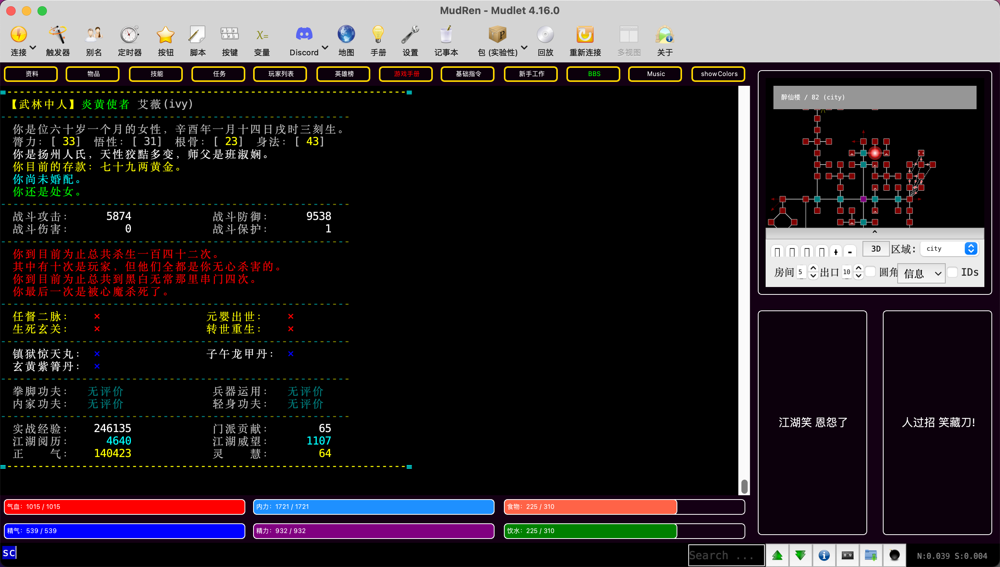
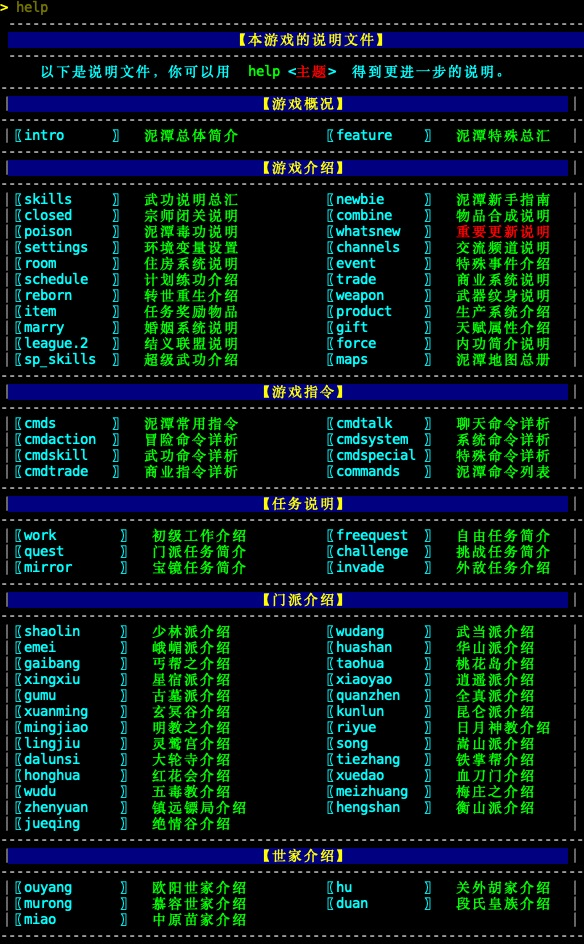

# 炎黄群侠传MUD

炎黄MUD utf-8 版，推荐使用 FluffOS v2019 最新版驱动。

 - 游戏驱动下载地址：https://bbs.mud.ren/threads/4

## LIB说明

本游戏为侠客行类文字MUD游戏，底层为炎黄2003，LIB代码有大量借鉴国内优秀的LIB，开源在此方便对MUD游戏感兴趣的玩家。

## 启动说明

游戏集成了[mudcore](https://github.com/mudcore/mudcore)框架，请使用以下指令下载源码：

    git clone --recurse-submodules https://github.com/oiuv/mud.git

如果你已经直接clone了项目，请使用以下指令更新子模块：

    git submodule update --init

### 环境配置

请把`data`目录中的`.env.example`复制为`.env`，并根据需要修改环境配置。

### 启动服务

使用以下方式启动游戏：

    driver config.ini

如果是开发学习，使用以下方式之一开启调试模式：

    driver config.ini -fdebug
    driver config.ini -d

 * 5566 端口为GBK编码
 * 6666 端口为UTF-8编码
 * 8888 端口为WEBSOCKET访问

> 推荐使用[mudlet](https://github.com/Mudlet/Mudlet)客户端连接游戏，推荐使用UTF-8编码进行游戏。

注册ID为 `mudren` 的帐号为游戏管理员(admin)。

线上体验请访问：https://mud.ren:8888/

求助答疑请访问：https://bbs.mud.ren
