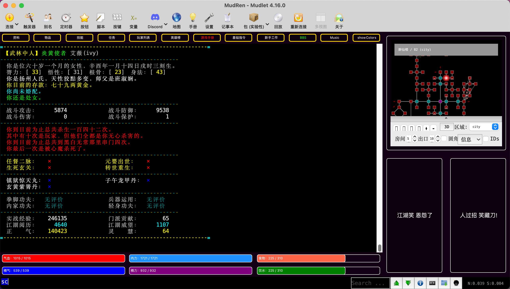
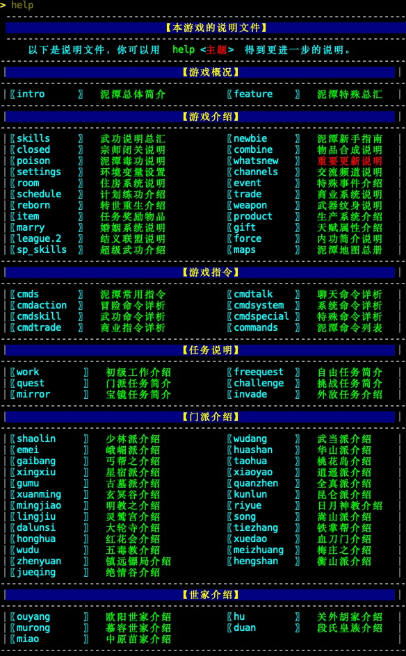

# 炎黄群侠传MUD
[![zread](https://img.shields.io/badge/Ask_Zread-_.svg?style=flat&color=00b0aa&labelColor=000000&logo=data%3Aimage%2Fsvg%2Bxml%3Bbase64%2CPHN2ZyB3aWR0aD0iMTYiIGhlaWdodD0iMTYiIHZpZXdCb3g9IjAgMCAxNiAxNiIgZmlsbD0ibm9uZSIgeG1sbnM9Imh0dHA6Ly93d3cudzMub3JnLzIwMDAvc3ZnIj4KPHBhdGggZD0iTTQuOTYxNTYgMS42MDAxSDIuMjQxNTZDMS44ODgxIDEuNjAwMSAxLjYwMTU2IDEuODg2NjQgMS42MDE1NiAyLjI0MDFWNC45NjAxQzEuNjAxNTYgNS4zMTM1NiAxLjg4ODEgNS42MDAxIDIuMjQxNTYgNS42MDAxSDQuOTYxNTZDNS4zMTUwMiA1LjYwMDEgNS42MDE1NiA1LjMxMzU2IDUuNjAxNTYgNC45NjAxVjIuMjQwMUM1LjYwMTU2IDEuODg2NjQgNS4zMTUwMiAxLjYwMDEgNC45NjE1NiAxLjYwMDFaIiBmaWxsPSIjZmZmIi8%2BCjxwYXRoIGQ9Ik00Ljk2MTU2IDEwLjM5OTlIMi4yNDE1NkMxLjg4ODEgMTAuMzk5OSAxLjYwMTU2IDEwLjY4NjQgMS42MDE1NiAxMS4wMzk5VjEzLjc1OTlDMS42MDE1NiAxNC4xMTM0IDEuODg4MSAxNC4zOTk5IDIuMjQxNTYgMTQuMzk5OUg0Ljk2MTU2QzUuMzE1MDIgMTQuMzk5OSA1LjYwMTU2IDE0LjExMzQgNS42MDE1NiAxMy43NTk5VjExLjAzOTlDNS42MDE1NiAxMC42ODY0IDUuMzE1MDIgMTAuMzk5OSA0Ljk2MTU2IDEwLjM5OTlaIiBmaWxsPSIjZmZmIi8%2BCjxwYXRoIGQ9Ik0xMy43NTg0IDEuNjAwMUgxMS4wMzg0QzEwLjY4NSAxLjYwMDEgMTAuMzk4NCAxLjg4NjY0IDEwLjM5ODQgMi4yNDAxVjQuOTYwMUMxMC4zOTg0IDUuMzEzNTYgMTAuNjg1IDUuNjAwMSAxMS4wMzg0IDUuNjAwMUgxMy43NTg0QzE0LjExMTkgNS42MDAxIDE0LjM5ODQgNS4zMTM1NiAxNC4zOTg0IDQuOTYwMVYyLjI0MDFDMTQuMzk4NCAxLjg4NjY0IDE0LjExMTkgMS42MDAxIDEzLjc1ODQgMS42MDAxWiIgZmlsbD0iI2ZmZiIvPgo8cGF0aCBkPSJNNCAxMkwxMiA0TDQgMTJaIiBmaWxsPSIjZmZmIi8%2BCjxwYXRoIGQ9Ik00IDEyTDEyIDQiIHN0cm9rZT0iI2ZmZiIgc3Ryb2tlLXdpZHRoPSIxLjUiIHN0cm9rZS1saW5lY2FwPSJyb3VuZCIvPgo8L3N2Zz4K&logoColor=ffffff)](https://zread.ai/oiuv/mud)

炎黄MUD utf-8 版，推荐使用 FluffOS UTF8版驱动。

 - 游戏驱动下载：https://bbs.mud.ren/threads/4
 - 线上游戏体验：https://mud.ren:8888/

## LIB说明

本游戏为侠客行类文字MUD游戏，底层为炎黄2003，LIB代码有大量借鉴国内优秀的LIB，开源在此方便对MUD游戏感兴趣的玩家。

## 启动说明

游戏集成了[mudcore](https://github.com/mudcore/mudcore)框架，请使用以下指令下载源码：

    # 从github安装（国外推荐）
    git clone --recurse-submodules https://github.com/oiuv/mud.git
    # 从gitee 安装（国内推荐）
    git clone --recurse-submodules https://gitee.com/mudren/mud.git

如果你已经直接clone了项目，请使用以下指令更新子模块：

    git submodule update --init

> 提示：国内用户[mudcore](https://github.com/mudcore/mudcore)子模块可使用gitee镜像地址

- https://gitee.com/mudcore/mudcore.git

### 环境配置

请把`data`目录中的`.env.example`复制为`.env`，并根据需要修改环境配置。

### Windows 编译驱动

在 **MSYS2 MinGW64** 终端中执行：

~~~bash
bash build_msys2.sh
~~~

脚本默认更新 MSYS2、安装依赖，对独立的 `fluffos/` 仓库执行 `git checkout -- .` 恢复已跟踪文件，再通过 `git pull --ff-only` 更新源码。构建启用 CRYPTO（提供 `hash`）和 SQLite，生成静态 EXE；成功后复制到项目 `bin/`，复制前会检查本项目的驱动和编译工具是否仍在运行。

MSYS2 核心升级若要求关闭终端，重新打开 MinGW64 终端后再次执行脚本。已有源码和依赖时，可以跳过更新，只编译验证：

~~~bash
BUILD_JOBS=4 bash build_msys2.sh --local --no-install
bash build_msys2.sh --help
~~~

`--local` 跳过软件包及源码更新；`--no-install` 保留当前项目的驱动，产物位于 `fluffos/build-msys2/bin/`。脚本可从其他目录使用完整路径调用，构建目录始终位于项目内。

### 启动服务

使用以下指令启动游戏：

    driver config.ini

> 推荐使用`run.sh`或`run.bat`脚本启动项目。

Windows 的 `run.bat` 使用 `config.cfg`，可从任意目录调用。启动前会检查本项目的驱动进程和配置中的监听端口；已运行时显示进程号，端口被占用时停止启动。驱动在后台运行，调试日志位于 `log/debug.log`。

如果是开发学习，使用以下方式之一开启调试模式：

    driver config.ini -fdebug
    driver config.ini -d

 * 5566 端口为GBK编码
 * 6666 端口为UTF-8编码
 * 8888 端口为WEBSOCKET访问

> 推荐使用[mudlet](https://github.com/Mudlet/Mudlet)客户端连接游戏，推荐使用UTF-8编码进行游戏。

注册ID为 `mudren` 的帐号为游戏管理员(admin)。

求助答疑请访问：https://bbs.mud.ren/nodes/6
