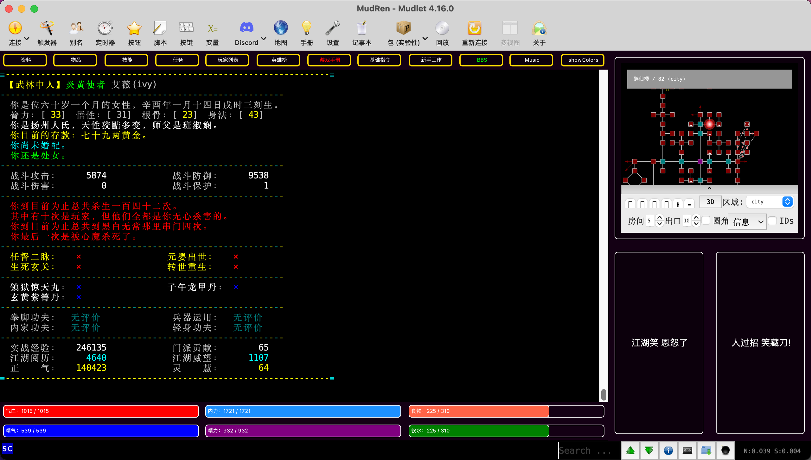
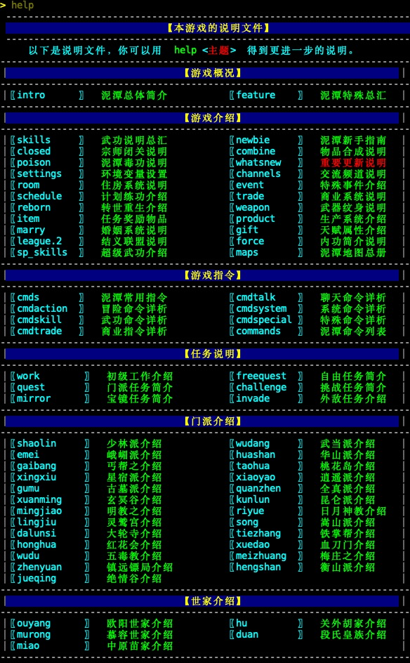

# 炎黄群侠传MUD
[![zread](https://img.shields.io/badge/Ask_Zread-_.svg?style=flat&color=00b0aa&labelColor=000000&logo=data%3Aimage%2Fsvg%2Bxml%3Bbase64%2CPHN2ZyB3aWR0aD0iMTYiIGhlaWdodD0iMTYiIHZpZXdCb3g9IjAgMCAxNiAxNiIgZmlsbD0ibm9uZSIgeG1sbnM9Imh0dHA6Ly93d3cudzMub3JnLzIwMDAvc3ZnIj4KPHBhdGggZD0iTTQuOTYxNTYgMS42MDAxSDIuMjQxNTZDMS44ODgxIDEuNjAwMSAxLjYwMTU2IDEuODg2NjQgMS42MDE1NiAyLjI0MDFWNC45NjAxQzEuNjAxNTYgNS4zMTM1NiAxLjg4ODEgNS42MDAxIDIuMjQxNTYgNS42MDAxSDQuOTYxNTZDNS4zMTUwMiA1LjYwMDEgNS42MDE1NiA1LjMxMzU2IDUuNjAxNTYgNC45NjAxVjIuMjQwMUM1LjYwMTU2IDEuODg2NjQgNS4zMTUwMiAxLjYwMDEgNC45NjE1NiAxLjYwMDFaIiBmaWxsPSIjZmZmIi8%2BCjxwYXRoIGQ9Ik00Ljk2MTU2IDEwLjM5OTlIMi4yNDE1NkMxLjg4ODEgMTAuMzk5OSAxLjYwMTU2IDEwLjY4NjQgMS42MDE1NiAxMS4wMzk5VjEzLjc1OTlDMS42MDE1NiAxNC4xMTM0IDEuODg4MSAxNC4zOTk5IDIuMjQxNTYgMTQuMzk5OUg0Ljk2MTU2QzUuMzE1MDIgMTQuMzk5OSA1LjYwMTU2IDE0LjExMzQgNS42MDE1NiAxMy43NTk5VjExLjAzOTlDNS42MDE1NiAxMC42ODY0IDUuMzE1MDIgMTAuMzk5OSA0Ljk2MTU2IDEwLjM5OTlaIiBmaWxsPSIjZmZmIi8%2BCjxwYXRoIGQ9Ik0xMy43NTg0IDEuNjAwMUgxMS4wMzg0QzEwLjY4NSAxLjYwMDEgMTAuMzk4NCAxLjg4NjY0IDEwLjM5ODQgMi4yNDAxVjQuOTYwMUMxMC4zOTg0IDUuMzEzNTYgMTAuNjg1IDUuNjAwMSAxMS4wMzg0IDUuNjAwMUgxMy43NTg0QzE0LjExMTkgNS42MDAxIDE0LjM5ODQgNS4zMTM1NiAxNC4zOTg0IDQuOTYwMVYyLjI0MDFDMTQuMzk4NCAxLjg4NjY0IDE0LjExMTkgMS42MDAxIDEzLjc1ODQgMS42MDAxWiIgZmlsbD0iI2ZmZiIvPgo8cGF0aCBkPSJNNCAxMkwxMiA0TDQgMTJaIiBmaWxsPSIjZmZmIi8%2BCjxwYXRoIGQ9Ik00IDEyTDEyIDQiIHN0cm9rZT0iI2ZmZiIgc3Ryb2tlLXdpZHRoPSIxLjUiIHN0cm9rZS1saW5lY2FwPSJyb3VuZCIvPgo8L3N2Zz4K&logoColor=ffffff)](https://zread.ai/oiuv/mud)

炎黄MUD UTF-8 版。当前 MUDLIB 最低支持 **FluffOS v2026.0712.3**，请使用该版本或更新版本的驱动。

 - 游戏驱动下载：https://bbs.mud.ren/threads/4
 - 线上游戏体验：https://mud.ren:8888/

## LIB说明

本游戏为侠客行类文字MUD游戏，底层为炎黄2003，LIB代码有大量借鉴国内优秀的LIB，开源在此方便对MUD游戏感兴趣的玩家。

## 开发与权限规范

代码统一通过 Git 审查、测试和部署维护。后续开发按“玩家 / 管理员”两类角色设计，复用驱动 `wizardp()` 标记判断管理身份，不再细分巫师等级或兼容在线源码编辑体系；保留 UID/EUID、存档隔离及运行期授权，不把开发贡献者自动视为实服管理员。

现有六级权限实现和账号配置继续保留，功能正常即可共存，暂不计划迁移；新功能复用现有安全入口，但不新增对旧中间等级的依赖。只有具体场景表明迁移收益大于成本和风险时才另行评估，不以全面迁移为开发前提。详见[贡献指南](AGENTS.md)和[简化权限规范](docs/architecture/security-permissions.md)。

## 文档入口

- [游戏用户帮助](help/)：玩法说明、命令用法与操作帮助统一放在这里。
- [游戏更新说明](help/changelog)：所有面向玩家的更新须同步记录，玩家可在游戏中输入 `help changelog` 查看。
- [项目开发文档](docs/README.md)：本 MUD 的架构、实现与开发规范；随开发同步完善，不单独安排全量补齐。
- [FluffOS 文档](fluffos/docs/)与[驱动源码](fluffos/src/)：查阅当前 efun/apply 时必须使用所用驱动版本对应的这些资料，有疑义时以实现为准。
- [历史文档归档](doc/README.md)：旧 LPC、efun/apply 资料，不作为当前驱动的开发依据。

## 启动说明

游戏集成了[mudcore](https://github.com/mudcore/mudcore)框架，请使用以下指令下载源码：

    # 从github安装（国外推荐）
    git clone --recurse-submodules https://github.com/oiuv/mud.git
    # 从gitee 安装（国内推荐）
    git clone --recurse-submodules https://gitee.com/mudren/mud.git

如果你已经直接clone了项目，请使用以下指令更新子模块：

    git submodule update --init

> 提示：国内用户[mudcore](https://github.com/mudcore/mudcore)子模块可使用gitee镜像地址

- https://gitee.com/mudcore/mudcore.git

### 环境配置

驱动须为 **FluffOS v2026.0712.3 或更新版本**。当前 LIB 优先使用 `.lpc` 源文件，不再以旧驱动兼容为开发目标；已有 `.c` 文件继续保留。升级现有游戏时应先升级驱动，再更新 LIB 和 `mudcore` 子模块，并验证启动与全量编译。

请把`data`目录中的`.env.example`复制为`.env`，并根据需要修改环境配置。

### Windows 编译驱动

在 **MSYS2 MinGW64** 终端中执行：

~~~bash
bash build_msys2.sh
~~~

脚本默认更新 MSYS2、安装依赖，对独立的 `fluffos/` 仓库执行 `git checkout -- .` 恢复已跟踪文件，再通过 `git pull --ff-only` 更新源码。构建启用 CRYPTO（提供 `hash`）和 SQLite，关闭 MySQL/PostgreSQL；SQLite 后端编号与默认数据库编号均为 `1`，该编号用于 `db_connect()` 选择后端，不是 SQLite 版本号。仅构建安装所需的驱动及发布工具，生成静态 EXE，不构建上游单元测试或基准程序；成功后复制到项目 `bin/`，复制前会检查本项目的驱动和编译工具是否仍在运行。

MSYS2 核心升级若要求关闭终端，重新打开 MinGW64 终端后再次执行脚本。已有源码和依赖时，可以跳过更新，只编译验证：

~~~bash
BUILD_JOBS=4 bash build_msys2.sh --local --no-install
# 使用 FluffOS 常规 build 目录
bash build_msys2.sh --local --no-install --build-dir fluffos/build
# 在独立目录生成 Debug 调试版本
bash build_msys2.sh --local --no-install --debug --build-dir fluffos/build-debug
# 仅为本机或兼容 CPU 开启本机优化
bash build_msys2.sh --local --no-install --march-native
bash build_msys2.sh --help
~~~

`--local` 跳过软件包及源码更新；`--no-install` 保留当前项目的驱动，产物位于所选构建目录的 `bin/`。默认构建目录仍为 `fluffos/build-msys2`；可用 `--build-dir DIR` 指定 `fluffos/build` 或其他目录。相对路径始终以本项目根目录为准，与调用位置无关；也支持 Windows/MSYS2 绝对路径，含空格的路径须加引号，例如 `--build-dir "C:/builds/fluffos release"`。

`--march-native` 将 `MARCH_NATIVE` 设为 `ON`，启用针对编译机器 CPU 的优化；产物可能无法在较旧或不同指令集能力的 CPU 上运行。默认关闭；下次运行不传该选项时，会显式恢复为 `OFF`，不沿用缓存中的开启状态。关闭本机优化不影响常规 Release 优化。

`--debug` 将 `CMAKE_BUILD_TYPE` 设为 `Debug`；不传时始终使用 `Release`，不沿用缓存中的 Debug 配置。该选项不改变构建目录，可与 `--build-dir`、`--march-native` 组合使用；静态链接和数据库配置不变。

脚本不自动搬迁或删除旧构建目录。复用已有目录会按本次选项重新配置；若要同时保留 Release 和 Debug 产物，请用 `--build-dir` 指定不同目录。已有 CMake 缓存必须使用同一源码位置和生成器（`MSYS Makefiles`）；不兼容时应另选构建目录。

当前上游驱动使用 PCRE2，依赖包为 `mingw-w64-x86_64-pcre2`。脚本每次配置时重新探测 PCRE 的头文件和库，避免沿用升级前缓存中的 `libpcre.a`；无需删除整个构建目录。使用 `--local` 时须已安装相应依赖。

### Docker 部署

先启动 Docker 引擎，在 Linux Bash 或 Windows 的 MSYS2 Bash 中执行：

~~~bash
bash docker.build.sh
bash docker.run.sh start
bash docker.run.sh status
bash docker.run.sh logs
bash docker.run.sh stop
~~~

构建脚本默认恢复并更新 FluffOS 官方源码；`bash docker.build.sh --local` 使用本地已提交的版本（HEAD），跳过源码更新。构建通过 `git archive` 直接使用该版本自带的 Dockerfile，排除本地未提交文件和宿主机编译产物。

镜像完全使用 FluffOS 官方 Dockerfile 和默认功能。启动脚本在运行时设置工作目录及健康检查；不修改驱动源码、Dockerfile 或宿主机的 `fluffos/build/`。

启动脚本可从任意目录调用，容器名称根据项目路径生成。游戏目录挂载到 `/opt/mud`，使用 `docker.config.cfg`；首次启动补齐缺失的 `data/.env`，日志写入项目 `log/`。默认映射宿主机 `5566`（GBK）、`6666`（UTF-8）和 `8080`（网页/WebSocket）。网页地址为 `http://localhost:8080/`；网页客户端中请选择 `ws://`、实际服务器地址和端口 `8080`。

`start` 默认后台运行，等待健康检查通过后启用自动重启；启动失败时保留容器日志；`stop` 停止容器并保留日志；`restart` 重新创建容器以应用新镜像。`run` 前台运行，按 Ctrl+C 停止游戏；`logs` 持续跟踪输出，退出查看不影响游戏。`status` 在运行时返回 0，未运行时返回 3。

宿主机已有游戏占用默认端口时，可以指定其他端口：

~~~bash
MUD_BIND_IP=127.0.0.1 MUD_TELNET_PORT=15566 MUD_UTF8_PORT=16666 MUD_WEB_PORT=18080 bash docker.run.sh start
bash docker.run.sh help
bash docker.build.sh --help
~~~

`MUD_DOCKER_IMAGE` 可指定镜像名（默认 `fluffos:latest`），构建和启动时使用相同值。镜像只运行游戏驱动，NPC AI 服务需要单独部署。容器中的 `127.0.0.1` 指向容器自身，游戏的 `AI_SERVER_HOST` 与 NPC AI 的监听地址应根据实际容器网络配置。

Docker 启动脚本的回归测试使用独立容器和临时目录；需事先准备 `busybox:latest` 镜像：

~~~bash
RUN_DOCKER_TESTS=1 python -m unittest discover -s tools/tests -p test_docker_launcher.py -v
~~~

### 启动服务

使用以下指令启动游戏：

    driver config.ini

> 推荐使用`run.sh`或`run.bat`脚本启动项目。

Windows 的 `run.bat` 使用 `config.cfg`，可从任意目录调用。启动前会检查本项目的驱动进程和配置中的监听端口；已运行时显示进程号，端口被占用时停止启动。驱动在后台运行，调试日志位于 `log/debug.log`。

如果是开发学习，使用以下方式之一开启调试模式：

    driver config.ini -fdebug
    driver config.ini -d

 * 5566 端口为GBK编码
 * 6666 端口为UTF-8编码
 * 8888 端口为WEBSOCKET访问

> 推荐使用[mudlet](https://github.com/Mudlet/Mudlet)客户端连接游戏，推荐使用UTF-8编码进行游戏。

注册ID为 `mudren` 的帐号为游戏管理员(admin)。

求助答疑请访问：https://bbs.mud.ren/nodes/6
