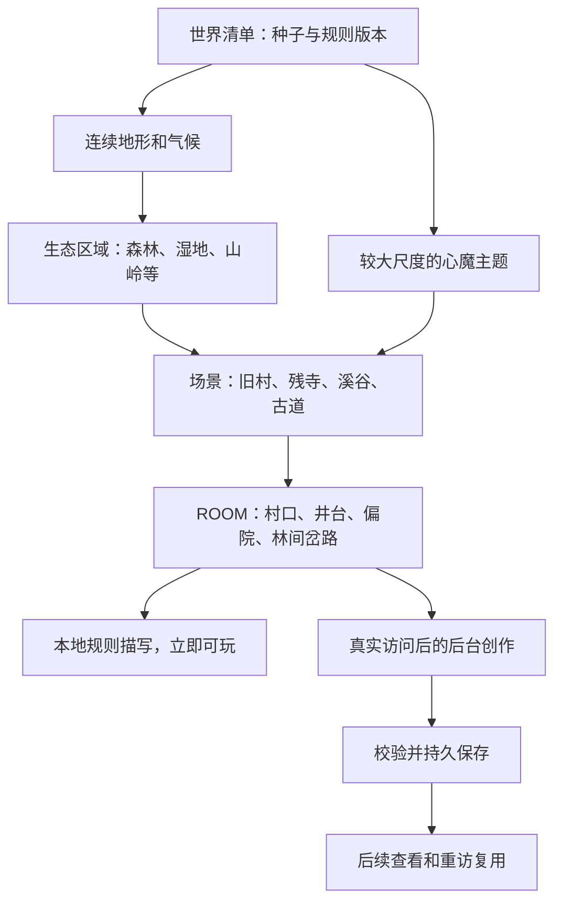

# Design

## Context

本设计记录 2026-09-24 确定的方案；动机与范围见 [proposal.md](proposal.md)。下表“现状”是规划时的源码基线，后续各节是目标设计，不代表全部已实现；当前实施与验收状态以 [validation.md](validation.md) 为准。

前置变更 [refactor-ai-service](../archive/2026-09-24-refactor-ai-service/design.md) 已完成并归档，NPC 兼容性验收范围见其 [validation.md](../archive/2026-09-24-refactor-ai-service/validation.md)。以下 AI 服务路径使用重构后的 `ai/`；公共通信、模型调用和业务注册由前置变更提供，场景队列与发布流程由本变更实现。

2026-09-25 阶段安排：先提交当前 M2 实现，再暂停新增世界功能，优先完成 `evolve-ai-capability-runtime` 的规范及现有 AI 能力迁移。下文保留世界业务与数据契约；模型/提示词的具体接入方式由该架构变更演进，不重复建设另一套 Agent 运行时。兼容回归通过后按 [tasks.md](tasks.md) 恢复，本变更不提前归档。

### 当前接入点

| 位置 | 已核对的现状或前置接口 | 对方案的约束 |
| --- | --- | --- |
| `adm/daemons/task/npc/zixu.c` | `ask_maze()` 直接 `new(MAZE, 0, 0, getoid(me))` | 起点目前不是规范虚拟路径；新入口需要统一身份，避免返回原点时再创建一份房间 |
| `u/mudren/maze.c` | 二维四向出口；第三坐标来自玩家对象编号；创建时随机封路、约 1/20 出现离境门 | 第三项不是高度，不能参与永久地理或文字键；独立随机出口无法保证双向和稳定 |
| 同上 | `init()` 遭遇心魔，`NPC_D->set_from_me(..., 120)`，保留多档掉落及引踪香生成 | 地图创作不能重跑初始化或顺便调整这些数值 |
| `adm/daemons/quest/_2_demon.c` | 原心魔对象身份、二十次击杀任务及既有奖励 | 新地图沿用任务记账，不替换心魔对象种类 |
| `adm/daemons/virtuald.c` | 只检查模板 `.c`；非数字坐标后缀委托 `query_maze_room()` | 新 `.lpc` 模板需要双扩展名支持，可复用非数字后缀路由 |
| `inherit/room/room.c`、`cmds/std/look.c` | 房间 `long()` 返回缓存字符串，`look` 调用它 | 只在新房间覆写 `long()` 做本地内容读取与合成，无需改全局查看命令 |
| `adm/daemons/logind.c` | 保存地点不是有效常规源码时回到安全登录点 | 不为本实验新增永久个人副本恢复；需要真实重连回归 |
| `ai/src/udp_server.py` | 前置重构提供：公共类型路由、8 KiB 数据报、独立业务容量；NPC 保留 chat/memory/config | 注册世界处理方，使用短确认，不进入 NPC 校验、会话锁或聊天工作池 |
| `ai/src/database.py` | 前置重构迁移现有 SQLite 短事务、进程内锁及 WAL 初始化能力 | 可复用连接设施；网络请求必须在事务和锁之外 |
| `help/huanjing` | 仍描述旧随机幻境，部分封路表述与源码不一致 | 上线时以实际实现更新帮助，不能保留旧地图承诺 |

### 参考依据

Minecraft 官方的世界生成说明将地形、生态区域、结构与自然细节分阶段处理，以种子和连续噪声形成地形，再选择适合的生态区域。[World Generation Overview](https://learn.microsoft.com/en-us/minecraft/creator/documents/world-generation?view=minecraft-bedrock-stable)

官方生态文档将地貌、生态配置、结构及实体区分开来；这支持本项目把“地理事实”“场景布局”“实际玩法对象”分开建模。[Biome JSON and Overview](https://learn.microsoft.com/en-us/minecraft/creator/documents/biomes/biomeoverview?view=minecraft-bedrock-stable)

本文以下区块大小、二维算法、道路连通方法和 AI 存档流程均为本项目设计，并非对 Minecraft Java 或 Bedrock 实现的逐项复刻。

## Goals / Non-Goals

**Goals:**

- 单次移动的地图计算量有界，FluffOS 主线程不等待网络响应、不扫描整个已探索世界。
- 共享且稳定的世界事实，允许独立的个人战斗实例；同一房间的成功描写只创作并发布一次。
- 先有可信的空间关系，再由 AI 的合理细节与文学表达提升沉浸感和探索体验；默认模板足以独立游玩，但不是创作的全部边界。
- 明确每种数据的唯一写入方、版本和恢复方式，确保 AI 服务停机后已生成世界仍可读。
- 用可复现地图、连通性检查和实际任务流程验收，不以“模型返回了一段文字”作为完成标准。

**Non-Goals:**

- 首期不做方块破坏建造、三维洞穴、水流物理、玩家领地、动态经济或生态模拟。
- 不让 AI 生成 LPC、决定出口、设计数值奖励、改变门派正史或写入玩家秘密。
- 不实现完整的随机任务系统、长期 NPC 社会关系和客户端图形地图；这些可在稳定地图上另立变更。
- 不把算法实现到 `mudcore`，不修改官方 FluffOS，不引入 Redis、独立消息队列或新的 AI 供应商。

## Decisions

### 1. 世界由四层构成，计算区块独立于内容分区



| 层次 | 建议初始尺度 | 玩家感受 |
| --- | --- | --- |
| 大地貌与主题 | 约 128–512 ROOM 的变化尺度 | 连续走过一片山地或被同一种执念笼罩的地带 |
| 生态区域 | 通常几十至数百 ROOM，边界不规则 | 森林逐渐变稀、地面转湿，再进入芦荡 |
| 自然场景片区 | 约 24–96 ROOM 的局部变化 | 同一森林中仍有竹坡、林谷、密林等差异 |
| 建筑或聚落场景 | 首批约 9–40 个可进入 ROOM | 村口、巷道、井台、祠堂相互关联 |
| 单间 ROOM | 一次移动的空间单位 | 一个明确位置，不承诺固定米数 |
| 计算区块 | 16 × 16 坐标格 | 只影响内部计算与缓存，玩家不看到区块名称 |

这些范围是调图的初始参数；发布世界后，影响事实的参数冻结到世界版本中。生态不是“每块选一种”，场景也不被截断在 16 × 16 边界。

### 2. 首批内容：四种生态，多种空间角色

| 生态 | 默认环境和过渡 | 可落位的场景 | 首期生态表达 |
| --- | --- | --- | --- |
| 雾林 | 潮湿、乔木、苔石；向疏林和溪岸过渡 | 林间旧村、山门残寺、林道 | 树种、落叶、鸟鸣与林下视距 |
| 芦泽 | 低湿、浅水、滩地；向湿林和草坡过渡 | 废弃渡头、堤路、荒亭 | 芦苇、水鸟、泥痕与水声 |
| 苍岭 | 高差、岩坡、松林；向丘陵和寒林过渡 | 山道、关隘遗址、残寺 | 岩层、山风、松针与远山 |
| 寒原 | 寒冷、稀疏植被、积霜；向寒林过渡 | 废驿、石阵、古道 | 枯草、风雪痕迹与开阔视野 |

空间主题与生态正交。首批使用“迷惘、争胜、贪执、悔恨”的有限意象表：例如悔恨主题的旧村可以出现磨损门槛和无人回应的空院，争胜主题的关隘可有残破旗杆和兵刃旧痕。它们不宣称玩家做过某件事，不改变难度，也不自动生成能拿走的兵器。

首个内部演示采用固定测试种子，集中验证“雾林 → 旧村 → 残寺”；正式首版完成四种生态和首批结构模板。演示配置与正式世界使用不同世界 ID，不将测试地形覆盖到已游玩的正式世界。

场景示意（只展示空间关系，具体出口由地图事实决定）：

```text
林道 —— 村口 —— 旧巷 —— 井台 —— 后巷
                   |                  |
                 空院               祠堂
                   |
                 竹坡 —— 山门 —— 残寺前院
                                   |
                                 残殿
```

这里“旧村”和“残寺”分别拥有自己的共有事实；不是把每个 ROOM 当成一篇互不关联的小故事。

### 3. 固定种子与纯 LPC 生成

决定：地形、结构、道路和默认文本在游戏侧生成；Python 只负责创作和持久发布。否则 AI 服务停机将连带阻断探索。

- 世界清单含 `world_id`、`seed`、`generator_version`、`catalog_version`、事实参数、清单摘要、内容格式版本。没有清单时禁止静默随机创建正式世界。
- 地理函数输入只包含清单和坐标，不调用全局 `random()`，不读取当前时间或玩家属性。
- 初版使用整型坐标散列、固定点插值的二维 value noise，叠加有限频段；不要求引入 Perlin/Simplex 库。每个字段使用独立 salt。
- 高程、湿度和温度使用低频场；局部坡度由有限邻点高程得到。高程约 256/128/64 格、湿度与温度约 256/128 格、局部细节约 32/16 格为调图起点。
- 使用平滑插值和固定运算次序；散列每步明确位宽与掩码，不依赖平台随机实现或浮点边界分类。LPC 64 位整数中间值必须证明不溢出。
- `floorDiv` 与非负局部余数需显式实现：`x=-1` 对应区块 `-1`、局部格 `15`；不能直接依赖向零截断的除法。
- 初始安全坐标范围为每轴 ±1,000,000,000；边界不环绕。玩家体验是按需无限扩展，工程上不承诺数学无界。参数和内存容量无需随已探索范围增长。最外侧的不完整区块按合法坐标裁剪，枢纽和边界口限制在有效格内，必要时允许角点，不创建越界边界口；噪声采样的安全中间范围单独证明，不能在边缘读到溢出坐标。

生成顺序固定为：基础场 → 生境权重与过渡 → 候选场景 → 确定性结构接受 → 可行走图 → 房间事实与默认描写。使用多个生态适宜度及一、二候选的差值确定林缘等过渡，不能每房间独立掷骰选生态。

首期湿地、溪岸是稳定环境带，不宣称实现从山顶到海洋的真实河网。完整水系另行设计，避免为实验引入全局流域计算。

### 4. 场景锚点与跨区块一致性

决定：采用有界候选锚点和小型模板组合，不让模型决定建筑布局，也不由“第一个进入的玩家”决定结构占地。

- 以 32 × 32 的候选网格和种子产生抖动锚点；在适合的生态、坡度与距离条件下提出村落、残寺等候选。
- 首版模板最大包围范围限制在锚点每轴 ±12 格内。查询区块时枚举相交候选格及其冲突检查所需邻格；邻域大小从最大占地推导，不无限递归加载邻居。
- 每个候选有由坐标散列产生的固定优先级；与任何更高优先级候选冲突即拒绝，平局按锚点坐标排序。即使高优先级候选又因别处冲突被拒绝，也不回填低优先级候选，以换取严格局部、与生成顺序无关的结果。
- 模板规定房间角色、局部坐标、门径、连接点与必备地标；种子仅在少量验证过的变体中选择和旋转。不建设通用拼图引擎。
- 命名从小型武侠词表确定；`scene_id` 由锚点和类型确定。不同地点允许同名，机器身份必须唯一；不用维护无限世界全局名称去重表。
- 场景共有事实包含名称、生态、材质、荒废状态、主题意象和地标坐标；房间事实包含角色、植被、视线和允许提及的邻域地标。
- 跨区块道路和结构只读取邻区的纯事实与模板，不要求邻区 ROOM 已实例化。
- 模板显式声明内部连接和合法门径。接受候选前，将各区块内的结构格按内部连接分成片段；每个片段都必须有位于本区块的合法门径接入可修路区域，且不得阻挡预留骨架。任一片段不满足时整体拒绝候选；不裁掉部分结构、不临时增加门径或打穿墙体。此检查只枚举模板覆盖的有限区块，不能依赖相邻区块的生成先后。

### 5. 连通性是算法保证，不只是双向校验

仅让 A 的 east 对应 B 的 west，仍可能形成孤岛，因此分两层建立通路：

1. 每对相邻区块使用规范化的无向边键，确定同一个边界通行点，避开角点。世界有效范围内每条区块邻接边都有这样的保留通路。世界原点预留可进入的平台并接入本区枢纽；边界通行点与平台在结构候选检查时已可计算，冲突的封闭建筑模板必须拒绝，不能事后把道路凿穿祠堂墙壁。
2. 每个区块确定一个枢纽；在 256 格范围内用固定代价及确定性平局规则，将四个边界通行点连到枢纽。道路优先顺地势，必要时使用有规则定义的山径、浅滩或石桥。
3. 已接受场景的门径和落在本区块的可进入结构部分接入该网络。模板跨边界的出口由完整模板给出，双方从同一事实计算。
4. 普通荒野通行格按地形加入，再从枢纽做洪泛检查。剩余孤立普通格标为不可进入；必要结构格则必须先通过规则修路接入，不能悄悄删掉半个村落。
5. 跨边界除保留点和模板通路外，首版不另开随机口；区块内部普通边依据两端事实判定，并从同一无向边生成两个方向。

因此，相邻区块连通、每区块全部可进入房间连到枢纽，可推出整个有效世界的连通性。道路成本、转弯和场景遮蔽减少棋盘感；地图预览需要专门检查是否仍能看出规则网格。若明显，先改道路形态与尺度，不用 AI 掩盖结构问题。

地图计算失败不得悄悄保存另一版应急地形；应保持玩家在原合法位置，记录错误，并保留离境能力。

离境点规则是本次明确的地图行为变化：起点有固定 `out`；另每 4 × 4 个区块确定一个枢纽离境点，以种子选择具体区块。取消新世界的“重建随机 1/20 出门”，保证全局存在稳定的离境路径。门的物品描述和命令由 LPC 合成，不写入 AI 正文。

### 6. 世界身份与个人实例

三个身份不能混用：

| 身份 | 示例 | 生命周期 |
| --- | --- | --- |
| 公共世界 | `huanjing-v1` + 清单摘要 | 持久，规则冻结 |
| 内容位置 | 世界 + `x,y` + `facts_digest` | 持久，多玩家共用 |
| 战斗实例 | 本次玩家会话登记的 opaque ID | 临时，承载 NPC、战斗、物品 |

新路径规划为 `/d/illusion/world/huanjing-v1~12~-8~INSTANCE`。后缀以字母开头，通过现有 `query_maze_room()` 分支路由，不误入旧 `x,y,z` 解析。`world.lpc` 严格解析，核对登记的实例与世界，再创建房间。路径字段不能直接变成文件系统写入路径。

`virtuald.c` 的变更限定为正确识别 `.lpc` / `.c` 模板、保持现有优先语义及旧数字坐标调用；另加新路径回归，不重写所有旧虚拟地图。

入口先登记玩家实例，再 `load_object()` 规范起点，所有邻接路径保留同一世界及实例。普通移动不接受来自客户端的实例 ID；房间入口校验所有者，巫师诊断操作单独授权。GMCP/`setArea()` 使用公共二维位置，z 设为 0，实例 ID 保存在内部字段，不冒充高度。

实例登记有界并与玩家对象寿命关联；真实断线但对象仍在时保留。完全退出后停止新加载，等房间和对象按既有规则清理；驱动重启后不恢复临时战斗实例。新房间不作为永久 `startroom`；既有安全登录流程继续生效。模板蓝图无参数加载时只设置安全默认属性，不登记个人实例、不建动态地图；`updateall /` 必须能编译加载这些模板。

为了复用战斗规则，将 `maze.c` 中 `setDemon()`、`setInventory()`、遭遇入口提取到 `inherit/room/illusion_base.lpc`（继承现有 ROOM），旧 `maze.c` 和新 `d/illusion/room.lpc` 继承它。逐项比对原掉落表、概率、强度、对象路径和初始化时机；此提取不授权修正其他战斗问题。新房间 `init()` 在兼容的遭遇调用外增加轻量创作申请，`long()` 只读文字，绝不再调用 `setup()` 或生成物品。

### 7. AI 只写当前房间的静态描写

首期工作单位为“一个房间”，上下文单位为“房间所属场景”。一次访问不生成整片几百间 ROOM，也不先调用模型设计一份可变场景设定。

发送内容包括：

- 世界身份、内容键、事实摘要；稳定房间名称由本地生成。
- 当前生态及过渡信息、地形、场景名称、房间角色、主题意象。
- 当前可见的有限邻域地标、规范 ID 与允许提到的方向。
- 已知材质、植被和静态装饰，作为创作线索而非逐词白名单；不发送玩家个人经历。

不发送玩家姓名、武功、聊天历史；不使用 NPC 的记忆/RAG 流程。场景名、地点方向不能由模型重命名。实际天气状态、当前敌人、物品列表和离境门由游戏另行呈现；允许与环境相符的风声、松涛、凉意等文学描写，不将其一律当作越权修改天气，也不声称已发生规则未提供的时辰或天气变化。

2026-09-25 按用户确认修正创作边界：目标是更生动、自然、可辨认的世界，不是让模型复述目录。岩缝、盘根、松脂气息、局部陡峭岩面等未逐项列出的细节可以补充；角力、敌影等比喻可以烘托主题。“未写入输入字段”不等于“事实错误”，局部岩面也不代表整格或道路不可通行。仅在与确定的生态/空间事实冲突、明确承诺不存在的实际操作、或破坏游戏语境时限制。文风偏好单独评价，不自动升级为硬性失败。

高程、湿度、温度为归一化场值，坡度为邻域高度差指标，不是米、摄氏度或角度；模型无需据此报数或推导绝对地势。已知地貌和场景是整体依据，未建模的局部景物允许合理发挥。比喻中的劲敌不自动等于新增 NPC；明确声称有可攻击伏兵、可取宝物、隐藏出口则须有实际玩法支持。

模型输出严格 JSON，首版仅接受 `schema_version`、`description`、`used_fact_ids`。建议正文 120–240 个汉字，硬上限 360 个 Unicode 字符和 1,800 UTF-8 字节，最多两段；不生成短标题、出口字段或可执行内容。

发布前检查字段集合、类型、长度、控制字符、ANSI/终端控制、代码围栏、已知危险标记及事实 ID 子集，拒绝模型回传的额外命令、奖励和结构字段。世界键和摘要从任务记录赋值，不相信模型回传。结构校验不决定文采，也不对正文实行词语白名单。人工抽查自然性、氛围、相邻空间一致性和实际交互承诺；隔离实质矛盾，不因合理补白缺少对应字段或出现比喻词语而判废。不能宣称语义验证百分之百可靠，首期不增加第二个“审稿模型”调用。

### 8. 真实访问触发与服务隔离

`init()` 必须同时确认：在线交互玩家、玩家实际位于该房间、实例归属有效、该房间无有效内容且不在本地退避期。`create()`、`long()`、管理员编译及地图预览都不提交付费任务。

游戏侧内容守护程序通过 `ai_client_d.c` 的通用请求接口发送 `world_describe`，返回 `accepted / pending / ready / retry_later / failed` 等状态，不等模型。独立 `world_status` 仅供已知任务查询与管理，不产生调用。二者在统一 AI 服务的注册点绑定世界处理方；不修改 NPC 业务分支，也不要求 NPC 或玩家聊天字段。客户端只等待本次短确认，确认结束不代表场景生成完成。

- 仍使用当前环回 UDP 与 8 KiB 限制，实际请求按 UTF-8 字节测量；上下文目标不超过 6 KiB，超限回退并记录，不任意裁掉决定事实的字段。
- `request_id` 对应一次消息；`content_key` 对应房间事实，是持久去重键。相同键携带不同事实视为冲突，不能覆盖已有任务。
- 单玩家速率限制在 LPC 侧按在线玩家会话执行，不向模型发送玩家身份。内容守护程序持有有界内容状态与退避记录，消息编号、定时器和回调清理由通用客户端管理；为世界短请求配置独立容量。单次消息重传沿用相同编号，后续业务申请可用新编号但保持同一内容键，避免两层无界叠加重试。服务已经落库即算“接受”，不以 UDP 确认作为唯一事实。
- Python 的世界处理方使用独立有界容量处理短消息，并用独立单工作线程执行场景模型调用；公共 UDP 入口仅分发。模型调用复用 `ai/src/llm.py`，显式传入世界任务期限、输出上限和诊断标签，不能进入聊天池等待模型或占用 NPC 会话锁。
- 后台调度发现正在进行的聊天时暂缓启动新创作；已发出的模型调用不强制取消。共享供应商额度仍可能相互影响，发生 429 时让后台先退避，不承诺消除供应商侧竞争。
- 普通玩家看不到队列术语或进度提示；该创作不是一次需要立即回答的问答。

### 9. 持久队列与单一存档写入方

选择当前同机部署下的 **SQLite 主记录 + 只读 JSON 发布目录**。相比让 UDP 传回完整文字再由 LPC 落盘，避免新增大型结果重发、分片和跨进程确认协议；代价是首期需要共享本机目录。

| 数据 | 位置（计划） | 写入方 |
| --- | --- | --- |
| 冻结的正式世界清单 | `data/illusion_world/worlds/<world_id>.json` | 游戏管理入口，原子创建，已有清单拒绝改写 |
| 活跃世界/入口开关 | 游戏侧运行配置 | 授权管理员 |
| 场景任务、正文、调用计数 | `ai/data/world_content.db` | Python 服务 |
| 发布正文 | `data/illusion_world/content/<world_id>/<cx>_<cy>/<x>_<y>.json` | Python 服务，游戏只读 |
| 地形与文字内存缓存 | 游戏守护程序 | 游戏进程，容量有界，可淘汰 |

`WORLD_CONTENT_DIR` 默认解析到 `ai/../data/illusion_world`，沿用相对服务目录而非启动目录的规则；启动时核对世界清单摘要和目录权限。已有发布文件损坏时游戏回退并报错，管理修复从数据库重新导出，不重新问模型。重复 `world_describe` 命中已完成任务但发现发布文件缺失时，只安排重新导出；坏文件修复沿用同一流程，不把修复计为模型尝试。运行数据补充 Git 忽略规则和备份说明。

内容键为固定顺序、带长度边界编码的世界清单摘要、坐标与事实摘要的 SHA-256；LPC 与 Python 共用黄金向量验证序列化，不能分别对无序 mapping/dict 的普通 JSON 直接散列。提示词版本和模型名作为来源元数据，不进入自动缓存失效键。

数据库最小结构：

- `worlds`：世界清单摘要与允许的版本。
- `room_jobs`：唯一 `content_key`，世界与坐标、事实摘要及有限输入、状态、尝试数、下一次时间、租约、错误分类、验证后的正文、模型/提示词元数据、发布标志、创建/完成时间。
- `daily_usage`：日界线明确的外部调用预留数；成功、失败和重试都计入。首版按 UTC 日期计数，管理显示时明确时区。

```text
absent → queued → running → ready(unpublished) → ready(published)
                    |
                    +→ retry_wait → queued
                    +→ failed
```

模型调用之前，在短事务内认领任务、预留一次预算并设置租约，然后释放数据库锁。单任务请求超时初值 90 秒，租约 180 秒；最多三次尝试，失败后约 1 分钟、5 分钟再试，供应商 Retry-After 更长时遵从。禁用 SDK 隐式重试，由队列统一计算每一次外部尝试，防止预算与实际调用脱节。租约到期不能与尚存活的旧调用并发再执行，恢复只认领已确认终止的工作或上一进程遗留工作。参数是后台任务专用，不放宽当前 NPC 聊天的 80 秒整体限制。

正文通过校验后先提交数据库，再写同目录临时文件、flush/fsync 并原子替换目标文件，最后标记已发布。Windows 文件占用导致替换失败时只重试发布。重启后按索引分批恢复过期租约和未发布任务，不能全表加载到内存；不重新调用已经持久完成的模型结果。

模型已经收费但程序在正文入库前崩溃，可能发生一次补偿调用；以重试上限和预算限制这个窗口。可保证“成功发布内容不自动重做”，不能保证供应商外部调用恰好一次。

### 10. 读取、显示和失败回退

新房间 `long()` 从游戏内容守护程序读取本地快照，返回：有效正文或规则正文 + 游戏定义的固定交互提示。`look` 继续自行显示实时出口和对象列表。

每次 `look` 对该房间做一次轻量文件存在/修改状态检查；有新发布或未缓存文件才读取有限大小 JSON。因此房间对象无需重载，后台发布后的下一次查看即可看到新文字。对缺失文件仅做存在性检查，不据此无限发请求；正缓存采用 LRU，校验世界、坐标、事实摘要和正文大小后才能使用。

同一进程收到迟到旧请求确认时只更新对应任务状态，不持有已销毁 ROOM 或离线玩家的长期对象引用。不主动 `tell_room()` 或向移动后的玩家插入“生成完成”。

| 故障 | 行为 |
| --- | --- |
| AI 未启动、接口慢、丢包 | 默认描述可玩，有限重发/退避 |
| 模型返回无效内容 | 不发布，按尝试上限重试 |
| SQLite/磁盘写失败 | 不确认持久接受、不发布半文件，停止新创作并记录 |
| 预算/队列/存储上限达到 | 不无限积压；以后符合条件的真实访问再申请 |
| 发布文件丢失或损坏 | 默认描述；从已完成数据库结果修复，无需重新创作 |
| 世界事实摘要不匹配 | 拒绝复用或覆盖，报告版本冲突 |
| AI 服务停止 | 已发布 JSON 继续可读，新地图仍可生成 |

### 11. 容量和性能初值

下面是待压测确认的初值，不是现有性能实测结论：

| 参数/目标 | 初值 | 原因 |
| --- | --- | --- |
| 地形区块 LRU | 64 块 | 只保存元数据，不同时实例化 16,384 个 ROOM |
| 已读正文 LRU | 256 间 | 文本缓存可控，淘汰不删除磁盘数据 |
| 游戏内容状态 / 待确认 | 128 / 32 项 | 状态含退避记录；待确认低于公共客户端单调用方 64 项上限，不随断网和探索无限增长 |
| 后台排队量 | 256 项 | 已排队、重试和运行任务合计受限 |
| 场景模型并发 | 1 | 让问答优先，便于预算与恢复 |
| 单玩家申请 | 每分钟 6 个新内容键，允许一次小突发 | 沿途部分房间先保持规则文字，不要求所经房间马上写满 |
| 每日场景调用 | 300 次（含重试） | 先验证质量与实际使用量；不是货币费用硬保证 |
| 单次输入上限 | 6 KiB 的事实请求 | 兼容现有 UDP，控制模型成本 |
| 单次输出 | 1,024 tokens，正文硬上限 360 字符 | 控制长度及请求时间；被 token 截断的 JSON 不发布 |
| 创作存储预算 | 1 GiB 初始软阈值，预留系统磁盘空间 | 到达阈值停新创作，已有成果不自动淘汰 |
| 移动新增 CPU 目标 | 热区 p95 < 5 ms，冷区 p95 < 30 ms | 固定测试环境实测并记录样本和机器信息 |

存储监测计入数据库、WAL 和发布文件；文件系统块与临时写入有额外开销，需要预留空间。到阈值时停止接受新工作，为有限在途任务留足写入余量。预算不得通过删除已创作正文腾空间；先扩容、备份或由管理员明确维护。成本统计保留 token usage（供应商有返回时）与调用数，不在设计中写未经核实的模型价格。

所有纯计算以固定邻域为上限，不能借由查地标递归生成整片世界。若冷区预算不达标，优先减少缓存对象大小和重复采样，必要时分批预计算元数据；预计算永不触发 AI。禁止通过提高全局评估限制掩盖单次生成爆量。

### 12. 文件与职责规划

文件名可在实现时按附近结构微调，职责与边界保持：

| 模块 | 计划职责 |
| --- | --- |
| `adm/daemons/illusion_world_d.lpc` | 世界清单、纯地形接口、区块缓存、实例登记 |
| `inherit/illusion/generator.lpc` | 噪声、生态、锚点、连通图的确定性计算 |
| `d/illusion/catalog.json` | 有限生态、默认文字、场景模板与主题词表；版本进入清单 |
| `d/illusion/world.lpc` | 非数字虚拟路径路由与实例校验 |
| `d/illusion/room.lpc` | 房间事实、默认描述、真实进入钩子和本地正文读取 |
| `inherit/room/illusion_base.lpc` | 从现有幻境提取的共用遭遇与掉落逻辑 |
| `adm/daemons/illusion_content_d.lpc` | 内容键、本地 JSON 读取、有限请求/退避管理 |
| `adm/daemons/ai_client_d.c` | 复用前置变更提供的通用请求接口、关联回包及清理；本变更配置世界短请求容量 |
| `ai/src/world/service.py` | 注册 world_describe/world_status，短请求校验及持久受理 |
| `ai/src/world/generator.py` | 独立提示词与结果校验，调用公共 llm.py |
| `ai/src/world/store.py` | 持久任务、预算、正文和原子发布 |
| `cmds/test/illusion_world.lpc` | 导出固定种子地图与地形/连通测试，不调用模型 |
| `cmds/adm/illusion.lpc` | 状态、入口/生成控制、世界初始化和受限诊断 |
| `ai/scripts/world_content.py` | 查询和修复已完成存档；真实模型试运行必须显式 `--live` |

地图预览使用同一 LPC 生成结果导出二维字符图/JSON，必要时由离线工具渲染图；不在 Python 重新实现一套地形算法作为假验证。项目测试入口扫描和命令加载需验证 `.lpc` 可发现。

## Risks / Trade-offs

- [无限规模但内容重复] → 首期用少量模板验证空间质量；依靠不同地形、布局、意象组合产生变化。AI 文采不能代替新玩法，首期不宣称已有无限任务。
- [同机共享目录限制未来拆机] → 将发布格式与接口固定，当前选择共享目录降低复杂度；未来拆机另加同步层，地图读侧保持一致。
- [规则道路产生棋盘感] → 看真实预览，检查长走路线、林缘和结构密度；连通骨架保留，调整路径代价和内容尺度。
- [地标方向或可交互承诺幻觉] → 规范事实、有限引用、动态内容分开、硬校验和抽样审读；失败继续默认文字。
- [地图更好走改变单位时间收益] → 保持心魔/掉落公式仍不能保证收益完全相同；记录至少三档玩家样本的探索、遇敌和回城节奏，发现异常单独报告，不暗改奖励。
- [个人实例寿命和登录路径不兼容] → 独立规范路径、实例归属与过期检查，真实验证掉线重连、退出重登和驱动重启。
- [世界算法升级导致旧场景漂移] → 世界清单冻结；正式版本不原地改地貌目录。旧算法仅在还有在线实例时保留，升级维护先排空实例；保留存档不等于承诺永远运行所有旧版本。
- [驱动同步磁盘读取延迟] → 文件有大小上限、正文 LRU、只读本地盘；记录读取耗时，禁止每次查看全库扫描。
- [后台抢占供应商配额] → 独立工作线程、并发 1、聊天活跃时让行、429 退避；同一 API 账号仍有共享限流上限。
- [大量成功内容长期占盘] → 只保存探索过且通过生成的房间，按区块分目录，监测与预算停新写，定期备份而非自动清空。

## Migration Plan

开始实施前确认 `refactor-ai-service` 已完成、`ai/` 启动和现有 NPC 聊天通过验收。随后按以下三阶段交付；M1 运行时仍不依赖 AI 服务在线。

### M1：纯规则世界可玩

完成世界清单、固定点生成器、四向连通与虚拟路径，先用固定种子的雾林/旧村/残寺测试配置。AI 开关关闭。复用原心魔逻辑，旧入口保留；巫师可单独进入测试新世界。

验收：相同种子同图；负坐标与跨块无缝；普通出口双向；每个可进入房间连通；起点不会重复创建；原心魔任务能计数；地图计算不调用 AI。

### M2：小规模 AI 描写闭环

完成短任务协议、独立持久队列、正文校验和共享目录原子发布。选择 20–30 个固定测试房间，显式开启少量真实调用；自动测试使用假模型。

验收：第一次立即看默认；完成不刷屏；下次 look 用新文字；换玩家、清理房间与重启后复用；停服务仍读到存档；同一内容键并发只执行一次；故障窗口和丢包可恢复；周不通聊天不等待后台线程。

### M3：四生态内容与上线验收

补齐正式内容表、过渡带、结构变体和主题意象。调图完成后冻结正式种子与清单，再导入正式服务；测试世界内容不迁移到不同清单的正式坐标。

完成固定 256 × 256 范围及不少于 20 个种子检查，包含负坐标、极限坐标附近、不同生成顺序；各区块内部连通与边界成对性分别检查，避免把裁剪窗口外的路径误判为孤岛。抽查跨区块场景；测试预算、满磁盘、坏存档、超时、断线和重启，记录性能与约 50 段跨房间内容审读结果。通过后逐步向玩家开放新入口，先以小日限额运行。

### 上线与回退操作

1. 保持新入口关闭；部署代码、配置示例及目录权限，完成格式化检查和 FluffOS 编译。
2. 初始化独立测试世界，运行 M1/M2；正式内容验收后创建不可变正式清单并备份。
3. 启动 AI 服务时核对实际生效的模型/端点、世界摘要和内容目录，不打印 Key。系统环境变量仍优先 `.env`，文档需提醒沿用此现有行为。
4. 打开新入口，先让确定性世界承载玩家，再独立打开小额度创作。
5. 仅 AI 有问题时关闭创作，保留地图与存档。地图有问题时将后续入口切回旧幻境，让现有新世界玩家正常离境。
6. 需要回滚移除新模板的代码时，必须先排空新世界在线实例；备份 SQLite（使用一致性备份，包含 WAL 事务）和已发布内容，保留世界清单，不删除成果。

## Open Questions

以下细节可在 M1/M2 的调图和审读中定稿，不影响需求或技术路线：

- 正式世界的最终展示名称、种子及四类地貌的比例；默认以“心魔幻境”继续对玩家展示。
- 各场景的默认段落长度及主题意象措辞；默认正文范围已在上文约束。
- 冷区计算和正文读取在部署机器上的实测分位值；以上是验收目标，不能提前宣称达到。
